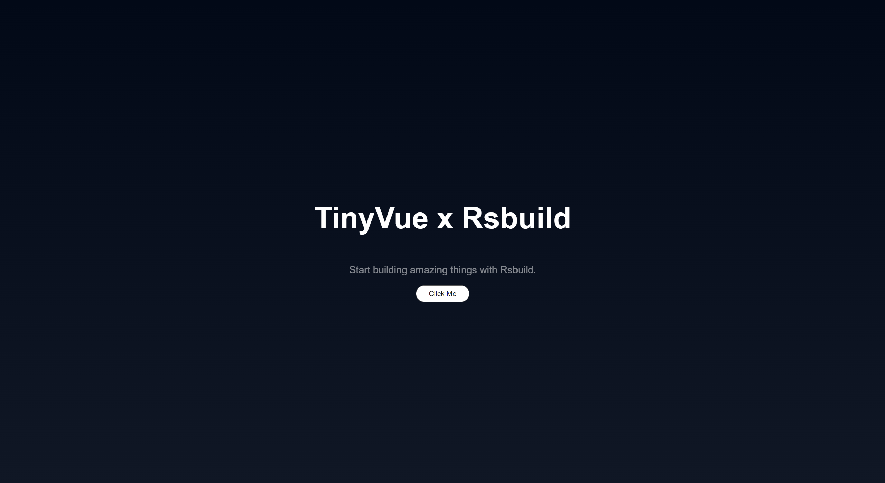

# 在 Rsbuild 中使用

Rsbuild 由 Rspack 驱动的构建工具，本文会尝试使用 Rsbuild 创建一个项目，并引入 TinyVue。

## 安装与初始化

在开始之前, 您可能需要安装[yarn](https://github.com/yarnpkg/yarn)或[pnpm](https://pnpm.io/zh)

```bash
pnpm create rsbuild
```

在初始化的过程中, `create-rsbuild` 提供了一系列模板, 这里我们选择 `Vue 3` 模板

在这期间, 工具会为我们自动初始化项目结构, 并安装重要的依赖(此时还没有安装 `TinyVue`, 我们将会在下一节安装)

## 安装TinyVue

本节会从 yarn 或 npm 或 pnpm 或 bun 安装并引入 TinyVue.

```bash
pnpm add @opentiny/vue
```

安装完成后, 修改 `rsbuild.config.ts`

```typescript
import { defineConfig } from '@rsbuild/core'
import { pluginVue } from '@rsbuild/plugin-vue'

export default defineConfig({
  plugins: [pluginVue()],
  source: {
    define: {
      'process.env': JSON.stringify({ ...process.env })
    }
  }
})
```

修改完成后, 我们修改 `src/App.vue`

```html
<template>
  <div class="content">
    <h1>TinyVue x Rsbuild</h1>
    <p>Start building amazing things with Rsbuild.</p>
    <tiny-button-group>
      <tiny-button> Click Me </tiny-button>
    </tiny-button-group>
  </div>
</template>

<script lang="ts" setup>
  import { TinyButton, TinyButtonGroup } from '@opentiny/vue'
</script>

<style scoped>
  .content {
    display: flex;
    min-height: 100vh;
    line-height: 1.1;
    text-align: center;
    flex-direction: column;
    justify-content: center;
  }

  .content h1 {
    font-size: 3.6rem;
    font-weight: 700;
  }

  .content p {
    font-size: 1.2rem;
    font-weight: 400;
    opacity: 0.5;
  }
</style>
```

修改完成后我们运行 `pnpm dev` 当出现下图时便代表启动成功



你可以在[该仓库](https://github.com/GaoNeng-wWw/tiny-vue-rsbuild.git)中找到本教程的示例
